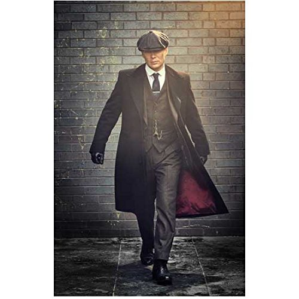
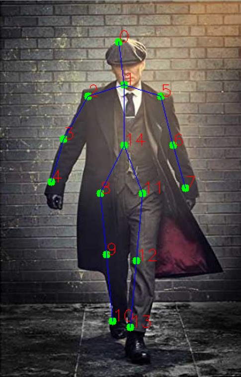

# Gesture Action Recognition

Input Image

  

Detection result

  

The application recognizes 15 body parts of a person by which the posture of person can be detected in each image or each video frame. Also, the x and y point of each body part can be used for detection a particular body movement like hand raising.

The model can be downloaded using this [link](https://huggingface.co/Tlaloc-Es/openpose/resolve/main/pose_iter_160000.caffemodel) also to read more about it you can use hugging face [link](https://huggingface.co/Tlaloc-Es/openpose/tree/main) 
